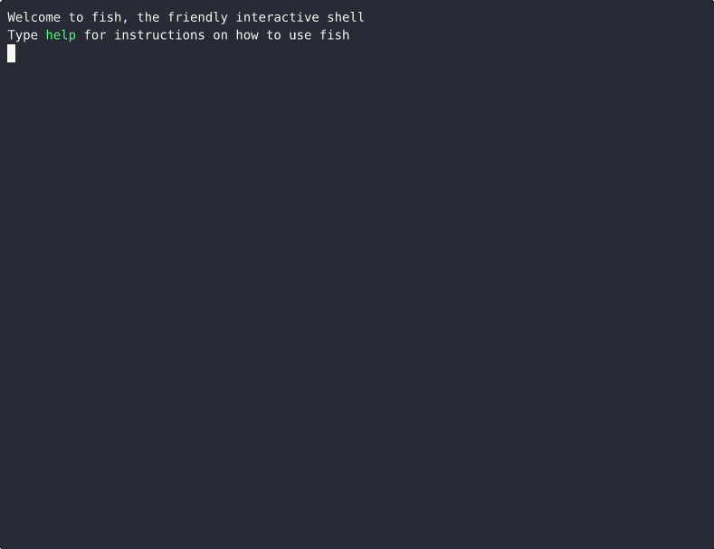

## How to build this project

assuming that you have installed [rust](https://www.rust-lang.org) compiler, you can build the project with
```
cargo build --release
```
The path to generated output will be printed. (it's in the ./target/release directory)

## Dependecies

the program requires glibc as a dependency (it's a common requisite)


